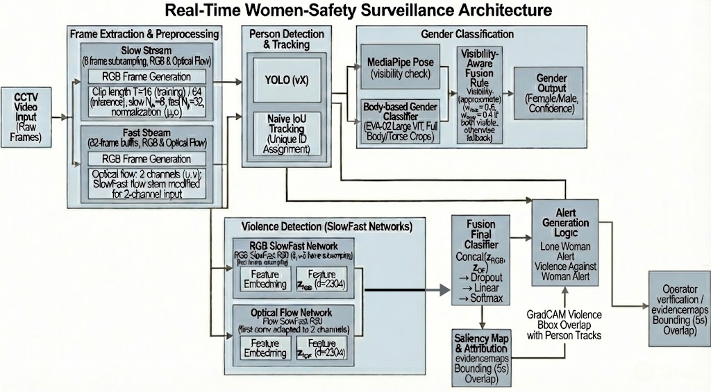

# DeepSafe: An Integrated Surveillance Framework for Women’s Safety Using Dual SlowFast Network and Vision Transformers

DeepSafe is an AI-based video surveillance framework for women safety analysis in public spaces. It combines person detection and tracking, visibility-aware gender classification, dual-stream violence recognition, Grad-CAM explainability, and context-aware alerting in one end-to-end pipeline.

## Architecture Diagram



The system is organized into five stages:

1. Person detection and tracking (`YOLOv5s + IoU tracker + MediaPipe visibility`).
2. Visibility-conditioned dual-model gender classification (`EVA-02 ViT-L/14`).
3. Dual-stream violence detection (`SlowFast-R50 RGB + SlowFast-R50 Optical Flow`, late fusion).
4. Fight-conditioned Grad-CAM explainability and evidence region localization.
5. Context-aware alert engine and evidence package generation.

## Key Features

- End-to-end safety analytics from raw video input.
- Visibility-conditioned gender fusion (face-only or body+face weighted fusion).
- Dual-stream violence understanding using RGB and optical-flow modalities.
- Grad-CAM-based evidence localization for interpretability.
- Rule-based alerts:
  - `LONE_WOMAN_AT_NIGHT`
  - `VIOLENCE_AGAINST_WOMEN`
- Automated evidence package capture (snapshot, overlay, clip, metadata).

## Repository Structure

```text
.
├── README.md
├── docs/
│   └── methodology.tex
├── notebooks/
│   ├── integrated-women-safety-system.ipynb
│   ├── dual-slowfast-network-based-violence-detection.ipynb
│   ├── gender-classification-face-2-phase-transformer.ipynb
│   └── gender-classifier-2phase-transformer.ipynb
├── tests/
│   └── test_patched_flow.py
├── proposed.PNG
├── System Overview.png
├── gradcam_overlay.jpg
└── output_annotated.mp4
```

## Model and Pipeline Summary

### Stage 1: Person Detection and Tracking

- Detector: `Ultralytics YOLOv5s` (`yolov5su.pt`)
- Tracker: greedy IoU matching with track aging
- Visibility estimation: `MediaPipe Pose Landmarker`

### Stage 2: Gender Classification (Visibility-Conditioned Fusion)

- Backbone: `EVA-02 Large ViT-L/14`
- Two models:
  - Face/upper-body model
  - Full-body model
- Fusion logic:
  - Full body visible: `0.6 * body + 0.4 * face`
  - Upper body only: `face-only`
- Temporal smoothing with short history window

### Stage 3: Violence Detection (Dual SlowFast)

- RGB stream: `SlowFast-R50`
- Optical-flow stream: `SlowFast-R50` adapted to 2-channel flow input
- Fusion: late fusion classifier on concatenated stream features
- Flow extraction: Farneback optical flow, clipped/encoded to match training distribution

### Stage 4: Grad-CAM Explainability

- Grad-CAM generated from the fused fight logit through RGB SlowFast target block
- Activation thresholding + contour extraction produces evidence bounding regions

### Stage 5: Context-Aware Alert Engine

- Lone woman at night rule (`night window + cooldown`)
- Violence-against-women rule (female track overlapping evidence regions + persistence)
- Evidence capture rule based on violence confidence and cooldown

## Environment and Dependencies

The integrated pipeline notebook uses the following core libraries:

- `torch`, `torchvision`, `timm`
- `opencv-python`
- `ultralytics`
- `mediapipe`
- `numpy`, `matplotlib`, `Pillow`

Recommended environment:

- Python `3.10+`
- CUDA-capable GPU strongly recommended for practical speed

Install baseline dependencies:

```bash
python -m venv venv
source venv/bin/activate
pip install --upgrade pip
pip install torch torchvision timm opencv-python ultralytics mediapipe numpy matplotlib pillow
```

Note: Depending on your CUDA and PyTorch setup, install GPU-specific `torch` wheels from the official PyTorch instructions.

## Quick Start

1. Activate your environment.
2. Open and run `notebooks/integrated-women-safety-system.ipynb` top-to-bottom.
3. Update paths in the notebook `CONFIG` block for:
   - input video
   - model checkpoints
   - output/evidence directories
4. Run the pipeline execution cells.

## Input and Output

### Inputs

- Video file (`.mp4`/OpenCV-readable format)
- Trained checkpoints for:
  - gender body model
  - gender face model
  - dual-stream violence model

### Outputs

- Annotated video: `output_annotated.mp4`
- Explainability artifact(s): `gradcam_overlay.jpg`
- Evidence packages (when triggered), including:
  - `raw_snapshot.jpg`
  - `gradcam_overlay.jpg`
  - short `clip.mp4`
  - `metadata.json`

## Current Validation Asset

A local test/validation asset used in this repository:

- `Bengaluru_News_Bengaluru_Woman_Assaulted_In_Broad_Daylight_CCTV_Captures_Attack_720P.mp4`

Optical-flow buffer behavior can be checked via:

- `tests/test_patched_flow.py`

## Reproducibility Notes

- The notebook currently includes Kaggle-specific paths in configuration examples.
- For local usage, replace Kaggle paths with your local checkpoint and data paths.
- Performance and alert behavior depend heavily on model quality, camera angle, and scene dynamics.

## Limitations and Responsible Use

- This project is a decision-support system, not a substitute for emergency response.
- Gender classification from appearance can be error-prone and socially sensitive.
- Surveillance systems must comply with local law, privacy regulations, and institutional ethics policy.
- False positives/negatives are possible in real-world scenes.

## Citation

If you use this project in academic work, cite the repository and the underlying models/datasets used in your experiments.

## License

No explicit license file is currently present in this repository. Add a `LICENSE` file before reuse/distribution under a specific license.
